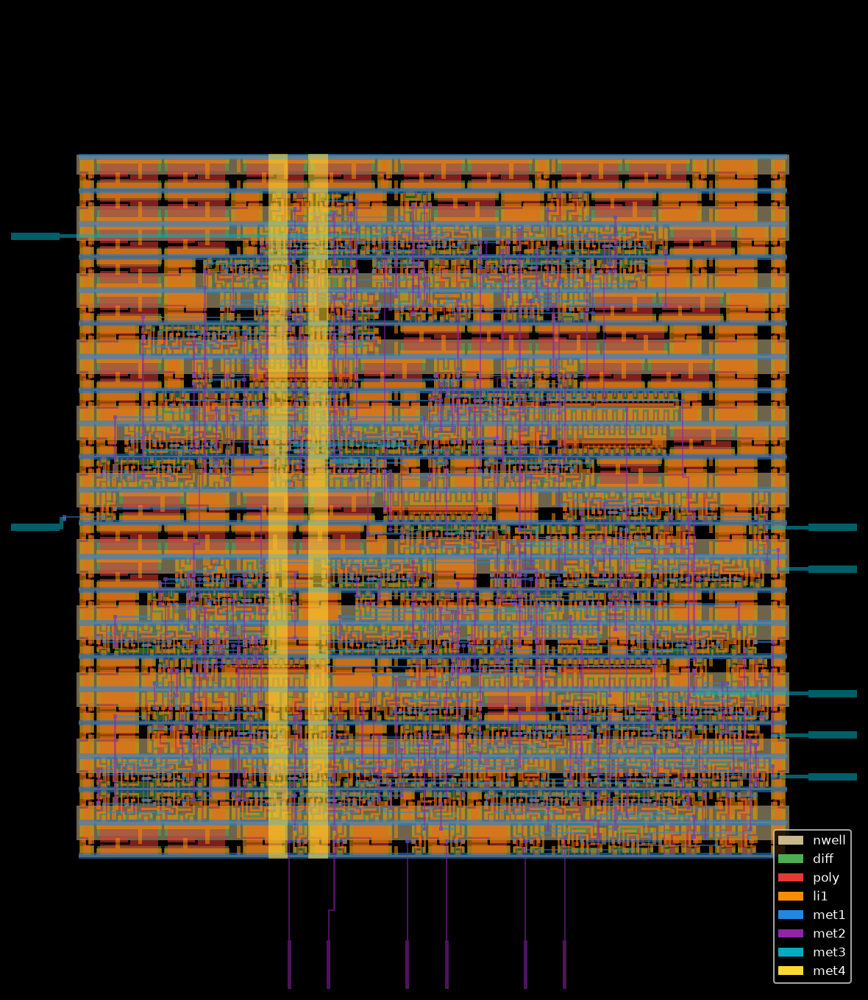
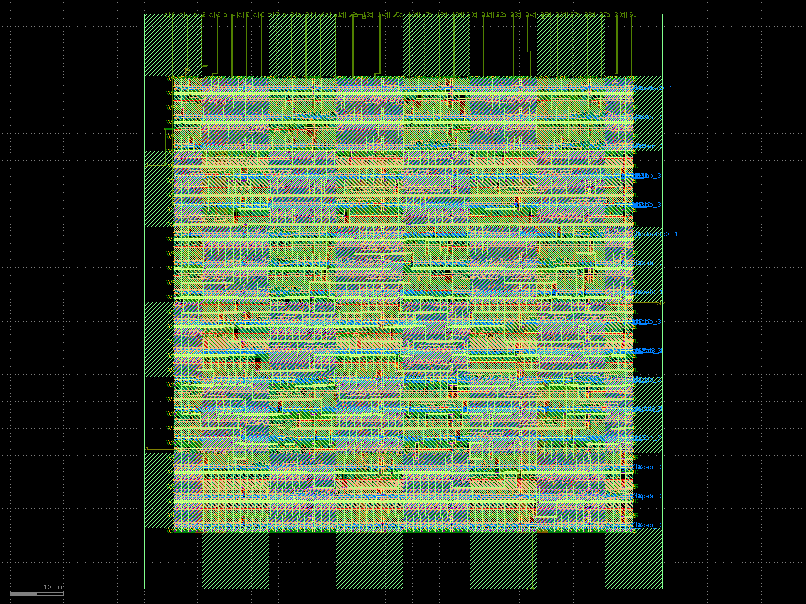

# VLSI: Open-Source RTL-to-GDSII Projects

Hands-on RTL-to-GDSII projects using an open-source flow (Yosys, OpenROAD, Magic, Netgen) on the SkyWater 130 nm PDK, run in GitHub Codespaces.

| Design | What it is | Verification | Flow |
|---|---|---|---|
| `designs/uart_tx` | UART transmitter (115200 baud @ 100 MHz) | cocotb + Icarus Verilog | OpenLane 2.3.10 |
| `designs/spm` | Serial-parallel multiplier (LibreLane example) | n/a (toolchain baseline) | LibreLane |
| `designs/handshake_dut` | Time-dependent READY/VALID protocol monitor | cocotb + Icarus Verilog | OpenLane-ready |

## uart_tx: UART transmitter

Layout rendered from the final GDS by `designs/uart_tx/plot_layout.py`.

### Results (10 ns clock)

| Metric | Value |
|---|---|
| Worst setup slack | +4.17 ns |
| Worst hold slack | +0.11 ns |
| Setup / hold violations | 0 / 0 |
| Cell instances | 203 |
| Std-cell area | 1,881 um^2 |
| Die area | 5,536 um^2 |
| Utilization | 56.8% |
| Total power | ~0.35 mW |
| Routed wirelength | 2,746 um |
| DRC / LVS / Antenna | clean |

Timing used OpenLane's generic SDC (ideal clock, default I/O delays), so treat it as a first-pass estimate. Raw numbers: `designs/uart_tx/results/metrics.json`.

### Verification
A cocotb testbench drives the design in Icarus Verilog and checks four bytes (0x55, 0xA3, 0x00, 0xFF) on the serial output.

### Reproduce
Needs Docker, Icarus Verilog, and Python 3.12 with `python3-venv` and `python3-tk` (Ubuntu packages).

    python3 -m venv .venv && source .venv/bin/activate
    pip install cocotb pytest openlane klayout matplotlib
    cd designs/uart_tx/test && make        # simulate
    cd .. && openlane --dockerized config.yaml   # RTL -> GDSII

---

## SPM (Serial-Parallel Multiplier): RTL-to-GDSII baseline

First end-to-end run of the open-source flow on my machine setup:
LibreLane (OpenLane 2) + SkyWater Sky130 PDK, run in GitHub Codespaces.

### Flow
RTL (Verilog) -> Yosys synthesis -> floorplan -> placement -> CTS ->
routing -> signoff (DRC, LVS, antenna) -> GDSII

### Results (nominal corner unless stated)
| Metric | Value |
|---|---|
| Target clock | 10 ns (100 MHz) |
| Worst setup slack | +3.59 ns (slow corner, ss_100C_1v60) |
| Worst hold slack | +0.253 ns (fast corner, ff_n40C_1v95) |
| Setup / hold violations | 0 / 0 |
| Die area | 10,367 um^2 |
| Core area | 7,214 um^2 |
| Std-cell area (excl. fill) | 4,547 um^2 |
| Total power (tt, 1.8 V) | ~1.48 mW |
| DRC (Magic + KLayout) | 0 |
| LVS errors | 0 |
| Antenna violations | 0 |

Timing was checked at three process corners (tt, ss, ff).

### Reproduce
    python3 -m venv .venv && source .venv/bin/activate
    pip install librelane
    python3 -m librelane --dockerized --pdk-root $HOME/.ciel designs/spm/config.yaml

### Notes
- Design comes from the LibreLane examples; this run validates the toolchain.
- Raw metrics: `metrics.csv`
