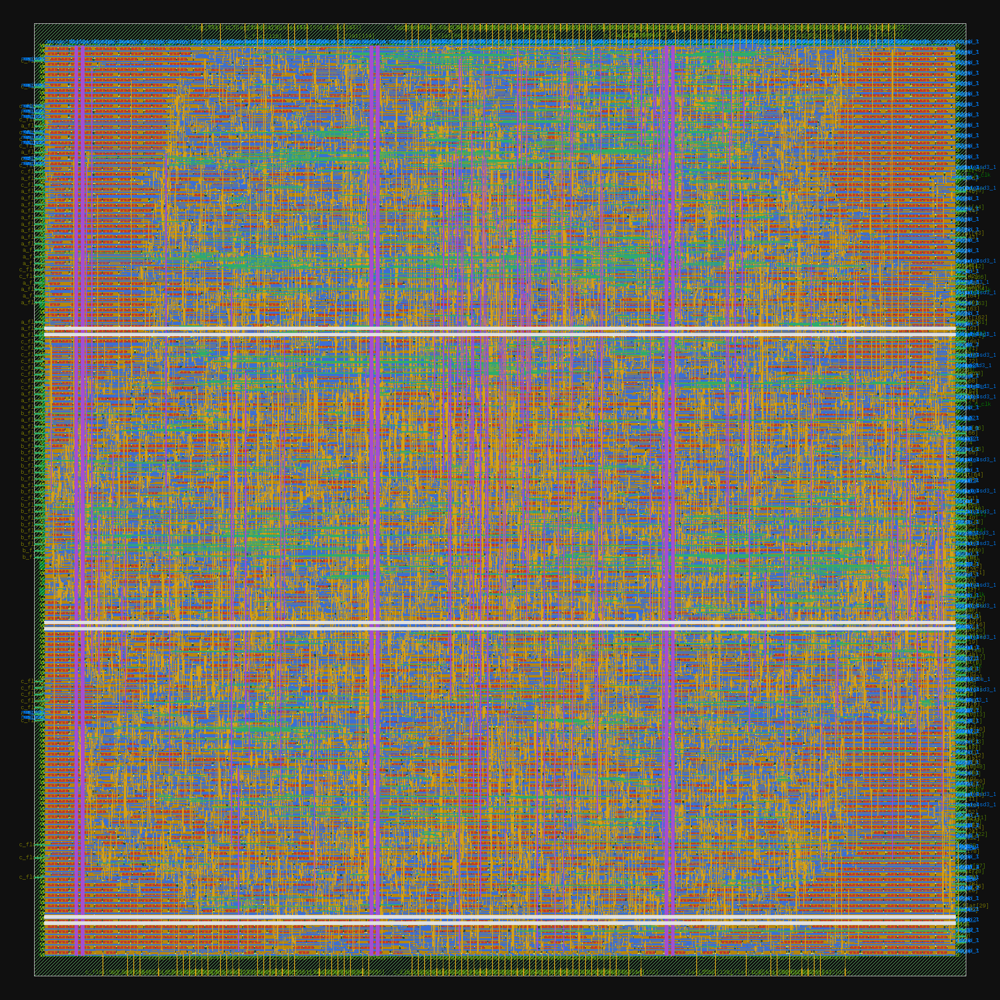

# VLSI: Open-Source RTL-to-GDSII Projects

Hands-on RTL-to-GDSII projects using an open-source flow (Yosys, OpenROAD, Magic, Netgen) on the SkyWater 130 nm PDK, run in GitHub Codespaces.

| Design | What it is | Verification | Flow |
|---|---|---|---|
| `designs/uart_tx` | UART transmitter (115200 baud @ 100 MHz) | cocotb + Icarus Verilog | OpenLane 2.3.10 |
| `designs/spm` | Serial-parallel multiplier (LibreLane example) | n/a (toolchain baseline) | LibreLane |
| `designs/matrix_mult` | 3x3 matrix multiplier for 8-bit unsigned matrices | cocotb + Icarus Verilog | OpenLane 2, Sky130 |
| `designs/handshake_dut` | Time-dependent READY/VALID protocol monitor | cocotb + Icarus Verilog | OpenLane-ready |

## uart_tx: UART transmitter


Layout rendered from the final GDS by `designs/uart_tx/plot_layout.py`.

### Results (10 ns clock)

| Metric | Value |
|---|---|
| Worst setup slack | +4.17 ns |
| Worst hold slack | +0.11 ns |
| Setup / hold violations | 0 / 0 |
| Cell instances | 203 |
| Std-cell area | 1,881 um^2 |
| Die area | 5,536 um^2 |
| Utilization | 56.8% |
| Total power | ~0.35 mW |
| Routed wirelength | 2,746 um |
| DRC / LVS / Antenna | clean |

Timing used OpenLane's generic SDC (ideal clock, default I/O delays), so treat it as a first-pass estimate. Raw numbers: `designs/uart_tx/results/metrics.json`.

### Verification
A cocotb testbench drives the design in Icarus Verilog and checks four bytes (0x55, 0xA3, 0x00, 0xFF) on the serial output.

### Reproduce
Needs Docker, Icarus Verilog, and Python 3.12 with `python3-venv` and `python3-tk` (Ubuntu packages).

    python3 -m venv .venv && source .venv/bin/activate
    pip install cocotb pytest openlane klayout matplotlib
    cd designs/uart_tx/test && make        # simulate
    cd .. && openlane --dockerized config.yaml   # RTL -> GDSII

---

## SPM (Serial-Parallel Multiplier): RTL-to-GDSII baseline

First end-to-end run of the open-source flow on my machine setup:
LibreLane (OpenLane 2) + SkyWater Sky130 PDK, run in GitHub Codespaces.

### Flow
RTL (Verilog) -> Yosys synthesis -> floorplan -> placement -> CTS ->
routing -> signoff (DRC, LVS, antenna) -> GDSII

### Results (nominal corner unless stated)
| Metric | Value |
|---|---|
| Target clock | 10 ns (100 MHz) |
| Worst setup slack | +3.59 ns (slow corner, ss_100C_1v60) |
| Worst hold slack | +0.253 ns (fast corner, ff_n40C_1v95) |
| Setup / hold violations | 0 / 0 |
| Die area | 10,367 um^2 |
| Core area | 7,214 um^2 |
| Std-cell area (excl. fill) | 4,547 um^2 |
| Total power (tt, 1.8 V) | ~1.48 mW |
| DRC (Magic + KLayout) | 0 |
| LVS errors | 0 |
| Antenna violations | 0 |

Timing was checked at three process corners (tt, ss, ff).


### Reproduce
    python3 -m venv .venv && source .venv/bin/activate
    pip install librelane
    python3 -m librelane --dockerized --pdk-root $HOME/.ciel designs/spm/config.yaml

### Notes
- Design comes from the LibreLane examples; this run validates the toolchain.
- Raw metrics: `metrics.csv`

<!-- matrix_mult:start -->
## 3x3 Matrix Multiplier (`designs/matrix_mult`)

Computes **C = A x B** for two 3x3 matrices of 8-bit unsigned numbers. Each of the 9 result
elements is a 20-bit value (the true maximum, 3 x 255 x 255 = 195,075, needs 18 bits).
The result is registered: A and B are sampled on the clock edge where `start = 1`, and one
cycle later `done` pulses high while `c_flat` holds the result. Reset is asynchronous and
active low. Ports are flat buses (`a_flat[71:0]`, `b_flat[71:0]`, `c_flat[179:0]`; element
(row i, column j) sits at bit offset (i*3 + j) * width) because Yosys does not accept
array ports.



### Results (OpenLane 2, Sky130)

| Metric | Value |
|---|---|
| Clock period | 40 ns (25 MHz) |
| Die size | 485 x 496 um (0.240 mm2) |
| Cell count (incl. fill/tap) | 21,863 |
| Cell area | 105,112 um2 |
| Worst setup slack | 17.80 ns |
| Worst hold slack | 0.11 ns |
| Total power (tool estimate) | 10.69 mW |
| Routed wirelength | 345,204 um |
| DRC | pass (0 violations) |
| LVS | pass (0 violations) |
| Antenna (violating nets) | pass (0 violations) |

### Verification

Five cocotb tests (Icarus Verilog, Python reference model): reset values, directed cases
(zero, identity, all-255, hand-checked example, idle hold), 200 random matrices with the
corner values 0 and 255 over-represented, back-to-back starts, and reset in the middle
of an operation.

### Reproduce

```bash
# 1. Simulate (cocotb venv)
cd designs/matrix_mult && make && cd ../..

# 2. RTL to GDS (repo .venv, Docker)
openlane --dockerized designs/matrix_mult/config.json

# 3. Layout picture and README numbers (after copying final/metrics.json and the GDS
#    from the run folder into designs/matrix_mult/results/)
python designs/matrix_mult/plot_layout.py
python designs/matrix_mult/update_readme.py
```

### Notes

- The design has 328 I/O pins (147 in, 181 out), so the die size is driven by pin count
  as much as by logic.
- The first run failed the antenna check on long wires. It passes with
  `RUN_HEURISTIC_DIODE_INSERTION`, `GRT_ANTENNA_ITERS = 10`, `GRT_ANTENNA_MARGIN = 30`
  and a tighter floorplan (`FP_CORE_UTIL = 45`); see `config.json`.
- Max-slew and max-capacitance warnings remain in some corners (each input fans out to
  three multipliers); they do not fail the flow.
<!-- matrix_mult:end -->
